# Exercise • Mapping Rooftop Solar Radiation

## Preamble

### Motivation

Today we'll be learning about mapping renewable energy by looking for rooftops suitable for solar panel installation in an urban area of Vancouver. We'll be looking at the Fairview neighbourhood, located just south of False Creek. This neighbourhood provides an excellent backdrop for our experiment with solar potential mapping, it has a mix of zoning including commercial, residential, high, and low density urban areas. This gives us plenty of different types of rooftops to look at.

### How this exercise will work

While we're running our demo (not the actual presentation), feel free to wave down any of the presenters who are not actively presenting to ask questions or get help setting up your environment. We only have so much time to run this exercise, so we won't pause until the end (unless Arc is taking its time to process data 💤).

This exercise has a lot of data processing! That means we might not get through all of it in our alotted presentation time. That's okay though! All the material we've presented will stay available in this repository for quite some time (if not forever). We'll choose a natural breaking point and you can continue the exercise on your own time if you'd like :)

### The Dataset

The data for this lab has been acquired from the [City of Vancouver's open data portal](https://opendata.vancouver.ca/). We've pre-processed the data to minimize the amount that needs to be downloaded and worked on. Here's a quick summary of what we've done:

- We extracted the Fairview polygon from the [local area boundaries](https://opendata.vancouver.ca/explore/dataset/local-area-boundary/information/?disjunctive.name) dataset. This was used to clip other datasets to our area of interest.
- LAS data was downloaded from the [LiDAR 2022](https://opendata.vancouver.ca/explore/dataset/lidar-2022/information/) dataset within the Fairview extent. These files were used to create a LiDAR dataset in ArcGIS, which was then converted into a DEM spanning the dataset. Finally, the DEM was clipped to the Fairview boundaries.
- The latest [Building Footprints](https://opendata.vancouver.ca/explore/dataset/building-footprints-2015/information/) (from 2015) has been clipped to the Fairview extent. No additional processing was required.

> [!NOTE]
> Please download the provided datasets to your machine **before** we get to the exercise portion of our presentation! You can find the dataset here.

## The Exercise

### 1. Setting up your environment

Open up ArcGIS to a new project and add a new map. Drag in the `building-footprints.shp` and `elevation-cov-fairview.tif` files. These should be found in the `Data.zip` folder, saved within this repository.

Let's get a better idea of whats going on in our research area. Input the Fairview DEM into the hillshape spatial analysis tool and check out the output.

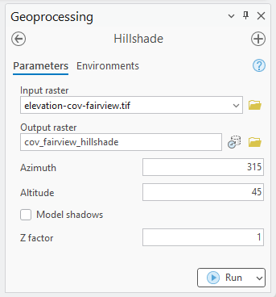

It might not be the highest spatial resolution DEM around, but it looks like we can make out rooftops!

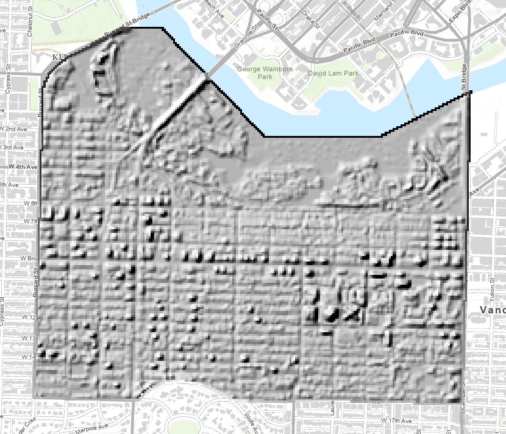

### 2. Calculating solar radiation

Next up, we'll be calculating the annual solar radiation received across our rooftops. To do this, we'll be using the *Raster Solar Radiation (Spatial Analyst)* tool. In the configuration, set the input raster as the DEM and the mask as our building footprints. We're looking for annual solar radiation, so set the dates to the start and end of 2025 (or 2026 if you're feeling crazy). If you want to be really accurate, switch out the Time Zone to UTC-8, but this doesn't matter too much.

Remember to use meaningful names, at the end of this you're going to have a ton of layers that each slightly differ. Making sense of this down the road is way more painful than being proactive.

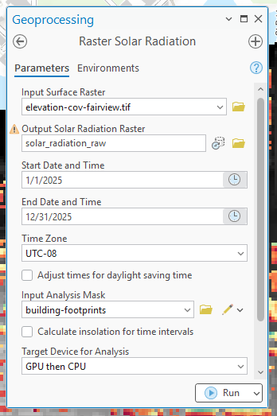

It will take a couple moments, but once the operation is complete, you should see a new layer where each pixel represents the annual radiation, colour coded from blue (low) to red (high).

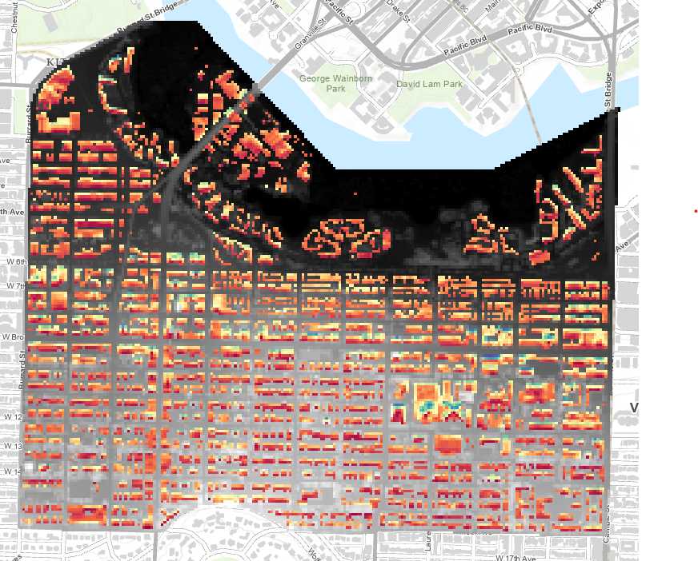

> [!NOTE]
> Solar irradiance is the instantaneous measurement of energy on a surface. There are a few ways to measure it, such as direct, diffuse, or total. With the raster solar radiation tool in ArcGIS, we're actually calculating **solar insolation**, the cumulative energy received by a surface over a given period of time. See [this breakdown from Sinovoltaics](https://sinovoltaics.com/learning-center/basics/solar-radiation-solar-insolation/) for more information.

### 3. Eliminating non-suitable rooftops

Now we're going to eliminate rooftops that don't meet the minimum requirements to install solar photovoltaics. Today, we'll be using the guidelines suggested by [NRCan's Solar Ready Guidelines](
https://natural-resources.canada.ca/sites/nrcan/files/canmetenergy/files/pubs/SolarReadyGuidelines_en.pdf) and additional suggestions from [ESRI's solar tutorial](https://learn.arcgis.com/en/projects/estimate-solar-power-potential/).

- Rooftops should be at an angle of less than 60 degrees.
- Rooftops should not be pointing north.
- The minimum viable solar insolation for a rooftop is 800 kWh/m^2

#### Slope

To install solar panels, the rooftop must be a maximum of 60°. To eliminate sections of rooftops meeting this criteria, we'll calculate the slope from the DEM. Pull up the *Surface Parameters (Spatial Analysis)* geoprocessing tool. For the configuration, put the DEM as the input, give the file a name, and ensure it's calculating slope (the "Parameter Type" field).

You should get a weird looking raster that ranges from 0 to ~75 to represent the different slopes between pixels in the DEM. Our LiDAR data wasn't the finest, but it looks like it was able to work well.

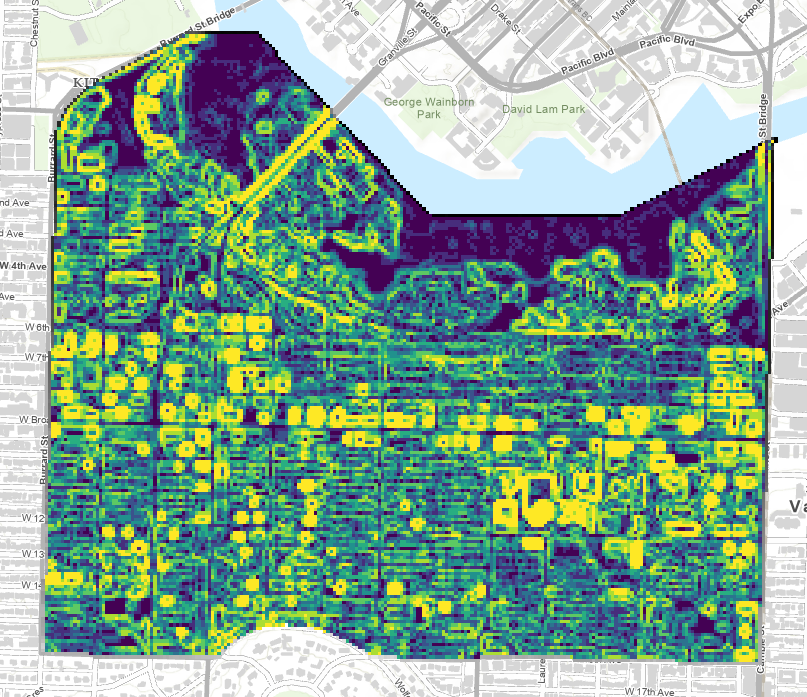

Next, we'll use the *Con (Spatial Analysis)* tool to remove the pixels with a slope steeper than 60 degrees. In the configuration, set the input raster as the slope, set the filter to remove values less than 60, and set our true constant raster as our solar insolation:

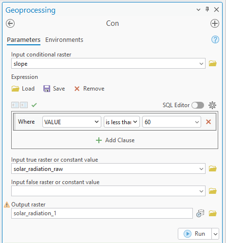

In your result, you should see a handful of pixels were removed:

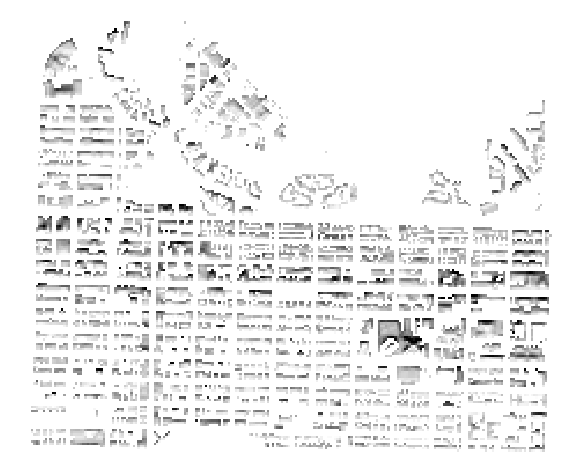

#### Aspect

As our study site is in the Northern Hemisphere, we'll be filtering out rooftops with a northern aspect. These rooftops will generally receive either not enough solar irradiance. Additionally, angle of incidence is important for solar photovoltaic productivity, and solar radiation will be most efficiently produced when hitting a pannel at an angle close to 90 degrees.

To eliminate rooftops with a northern aspect, first we'll use the *Surface Parameters (Spatial Analysis)* geoprocessing tool to calculate the aspect. For the configuration, use the DEM as the input, give the file a name, and toggle the *Parameter Type* to aspect.

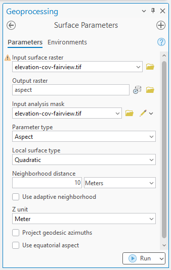

Not much new to say here, you should be seeing a colourful raster classifying the aspects. Whats cool here is that if you look closely, you can still make out the rooftops!

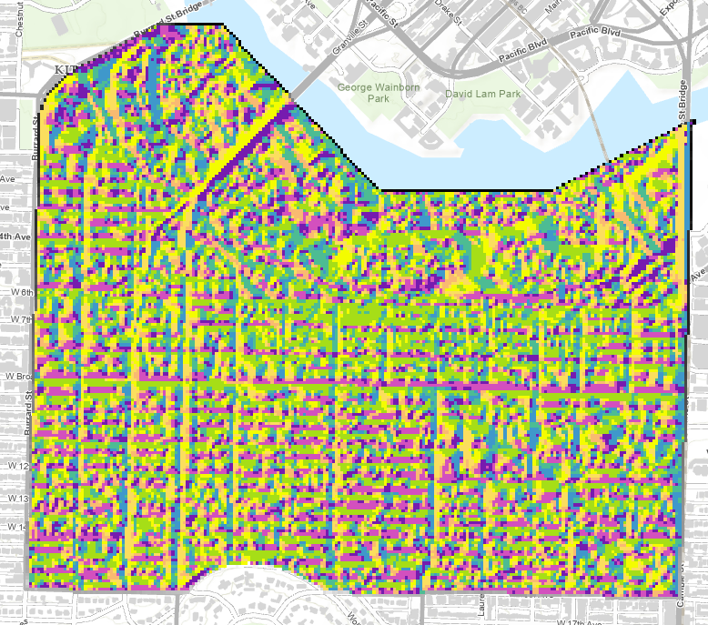

Similar to before, we'll be filtering the aspect using the *Con (Spatial Analysis)* tool. Use your aspect file as the input raster and the true constant value as your slope filtered insolation. For the filter, ensure the aspect is between 22.5 and 337.5

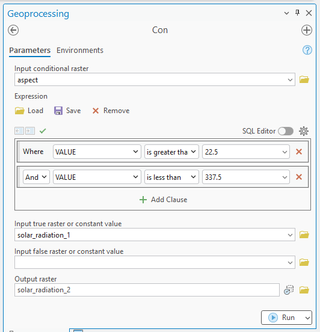

In the result, you should see a significant chunk of the rooftop segments were removed in this filtering.

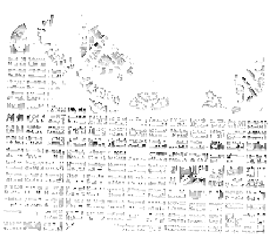

#### Minimum Solar Insolation

Finally, we're going to filter out any segment of rooftop that simply does not experience enough insolation to make solar panel insolation financially viable. Using the *Con (Spatial Analysis)* tool, remove rooftops with a solar insolation less than 800 kWh/m^2. To do this, set the input raster to your original solar insolation file and the true constant value to your slope & aspect filtered insolation.

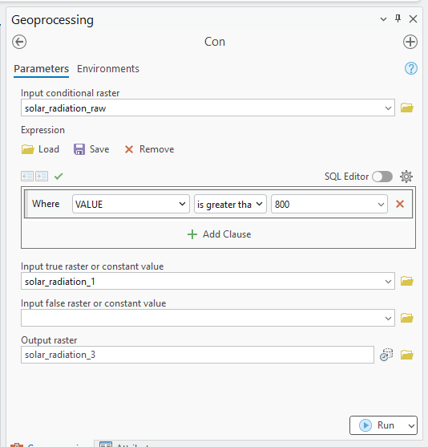

In your result, you'll notice not as many pixels are filtered out from this step. This is because a lot of the previous steps eliminated pixels that couldn't efficiently capture solar insolation.

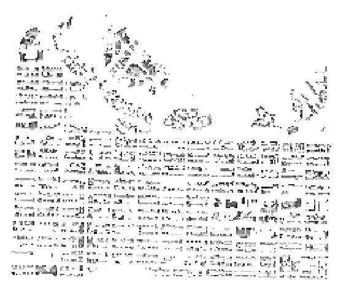

### 4. Calculating zonal statistics

Here are the steps you got to follow:

Mask with buildings and use our filtered power potential
Join it back into the building footprints

### 5. Output our final selection of rooftops

7. Make a selection to select all the buildings w/ a certain total area of usable rooftop

## Acknowledgements

